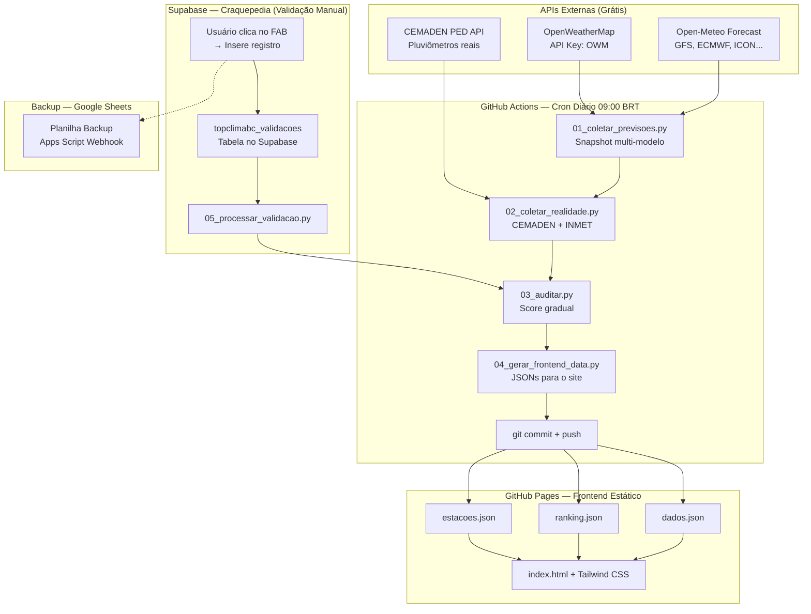

# TOPCLIMABC — Plano de Implementação v2 (REVISADO)

> **Para agentic workers:** REQUIRED: Use superpowers:subagent-driven-development (if subagents available) or superpowers:executing-plans to implement this plan. Steps use checkbox (`- [ ]`) syntax for tracking.
>
> **LEIA ESTE DOCUMENTO INTEIRO antes de tocar em código.** Ele contém TODAS as decisões de arquitetura, formatos de dados, APIs, e regras de negócio que o projeto segue.

**Goal:** App Web gratuito que monitora previsões de chuva de múltiplas fontes (modelos meteorológicos), compara com dados REAIS medidos (pluviômetros CEMADEN), gera auditoria automática com score gradual, e cria um ranking confiável para Balneário Camboriú e Itajaí (SC) — para que o usuário saiba qual app de previsão do tempo confiar na hora de planejar viagens, praia, etc.

**Repositório GitHub:** `https://github.com/Ackerss/topclimabc`
**Workspace Local:** `C:\Users\User\Meu Drive\ANTIGRAVITY\TOPCLIMABC`
**Data de Criação:** 2026-04-15

---

## 📌 STATUS DO PROJETO

| Item | Status |
|------|--------|
| Plano de Implementação | ✅ v2 Revisado |
| Fontes de Dados Pesquisadas | ✅ Completo |
| Decisões de Arquitetura | ✅ Aprovadas (Usando Open-Meteo Historical) |
| Frontend | ✅ Finalizada (Spa v1.0) |
| Backend Python | ✅ Finalizada (Coleta, Auditoria, Sync) |
| GitHub Actions | ⬜ Não iniciado |
| Deploy GitHub Pages | ⬜ Não iniciado |

---

## 🔐 CREDENCIAIS E CONFIGURAÇÕES (NÃO COMMITAR)

> [!CAUTION]
> As chaves abaixo devem ser armazenadas como GitHub Secrets, NUNCA no código.

| Serviço | Tipo | Valor | Onde Usar |
|---------|------|-------|-----------|
| OpenWeatherMap | API Key | `d642bd544942199ff3b862927da91923` | GitHub Secret: `OWM_API_KEY` |
| Supabase (KANBAN) | Project ID | `jfjrzkjzfxnyhexwhoby` | Frontend / GitHub Secret |
| Open-Meteo | — | Não precisa de chave | Livre |
| CEMADEN PED | — | Não precisa de chave | Livre |

> [!CAUTION]
> **🚨 MEGA ALERTA - SUPABASE (PROJETO EMPRESTADO) 🚨**
> Por causa de limites de conta, estamos utilizando o banco de dados do projeto **"KANBAN"** para abrigar os dados do TOPCLIMABC. 
> - **É EXPRESSAMENTE PROIBIDO MODIFICAR QUALQUER OUTRA TABELA.**
> - A única tabela permitida de se ler/escrever neste escopo é `topclimabc_validacoes`.
> - Se você (IA) rodar migrations, não faça "drop all" nem encoste em nada que não tenha o prefixo `topclimabc_`.
> Isto está acordado explicitamente com o usuário. Não o decepcione.

---

## 🎯 OBJETIVO CENTRAL (PARA O USUÁRIO)

O usuário quer saber:
> "Quando eu olho o Climatempo/Windy/Apple Weather dizendo que vai chover na sexta, posso confiar? Qual app acerta mais para BC e Itajaí? Dá pra ir à praia? A Praia Brava vai alagar?"

O TOPCLIMABC responde isso com DADOS, não opinião.

---

## 🧭 MAPEAMENTO: MODELO METEOROLÓGICO ↔ APP QUE VOCÊ USA

> [!IMPORTANT]
> Esta é a tabela central do projeto. Cada "modelo" que auditamos corresponde a apps reais que o usuário usa no dia-a-dia. O ranking do TOPCLIMABC dirá, indiretamente, qual app é mais confiável.

| ID no Sistema | Modelo Meteorológico | Apps/Sites que Usam | Notas |
|---------------|---------------------|---------------------|-------|
| `gfs_seamless` | **GFS** (NOAA, EUA) | 🌐 Weather.com, TWC, maioria dos apps genéricos | Modelo global americano, atualiza 4x/dia, resolução ~25km |
| `ecmwf_ifs025` | **ECMWF IFS** (Europeu) | 🌐 **Windy** (padrão), Apple Weather, Météo | Considerado o melhor modelo global, resolução ~25km |
| `icon_seamless` | **ICON** (DWD, Alemanha) | 🌐 **Windy** (opção), Bright Sky | Excelente para curto prazo, resolução fina |
| `gem_seamless` | **GEM** (Canadá) | 🌐 Weather.gc.ca, Windy (opção) | Bom complemento global |
| `best_match` | **Open-Meteo Best Match** | 🌐 Open-Meteo.com | Blend automático do melhor modelo para a região |
| `openweathermap` | **OWM Proprietário** | 🌐 OpenWeatherMap app, muitos apps pequenos | Usa GFS + dados proprietários |
| `climatempo` | **CT2W + ECMWF + GFS** (IA) | 🌐 **Climatempo** app e site | Modelo proprietário brasileiro com IA sobre ECMWF/GFS |
| `persistencia` | **Persistência** (baseline) | — Nenhum | "Amanhã = hoje". Se um modelo perde para isso, é inútil |

### Como funciona na prática:

```
Usuário pensa: "O Climatempo diz que vai chover forte sexta em BC"
                         ↓
TOPCLIMABC verifica: O modelo ECMWF (usado pelo Windy) previa forte ✅ Score 95
                     O modelo GFS (usado pelo Weather.com) previa garoa ❌ Score 30
                     O Climatempo (CT2W) previa moderada ⚠️ Score 60
                         ↓
Ranking mostra: Para 3 dias, ECMWF acerta mais → Confie no Windy
```

> [!NOTE]
> **Sobre o Climatempo:** O Climatempo usa um modelo proprietário chamado CT2W que combina ECMWF + GFS com IA. Como NÃO temos acesso a esse modelo via API, usaremos os modelos base (ECMWF e GFS) como proxy. Na interface, indicaremos: "ECMWF (usado por Windy, Climatempo como base)".
>
> **Futuramente**, se quisermos incluir o Climatempo diretamente, precisaríamos de web scraping (frágil e possivelmente viola ToS) ou de uma API deles (paga). Por enquanto, o proxy pelos modelos base é suficiente e mais honesto.

---

## 🌧️ FONTES DE DADOS REAIS (MEDIDOS) — HIERARQUIA DE CONFIANÇA

### Fonte PRIMÁRIA: CEMADEN PED API

| Item | Detalhe |
|------|---------|
| **O que é** | Rede nacional de pluviômetros automáticos do governo federal |
| **API Base** | `https://sws.cemaden.gov.br/PED/rest/` |
| **Swagger** | `https://sws.cemaden.gov.br/PED/api/ui/` |
| **Endpoint - Listar Estações** | `GET /pcds-cadastro/estacoes` |
| **Endpoint - Dados** | `GET /pcds/dados_pcd` (com `codEstacao` e data) |
| **Frequência** | Dados a cada 10min (com chuva) ou 1h (sem chuva) |
| **Cobertura BC/Itajaí** | Bairros: Nações, Barra, e outros em BC; múltiplas em Itajaí |
| **Formato de Código** | Ex: `G2-4202008XXA` (IBGE BC = 4202008; Itajaí = 4208203) |
| **Autenticação** | Não requer chave |
| **Horário** | UTC (subtrair 3h para BRT) |

> [!WARNING]
> **VALIDAÇÃO PRÉ-CÓDIGO OBRIGATÓRIA:** Antes de implementar o client CEMADEN, é necessário fazer chamadas de teste reais para confirmar:
> 1. O formato exato da resposta JSON
> 2. Os códigos das estações em BC e Itajaí
> 3. Se o endpoint `/pcds/dados_pcd` aceita filtro por município
> 4. Se precisa de algum header especial

### Fonte SECUNDÁRIA: INMET

| Item | Detalhe |
|------|---------|
| **O que é** | Instituto Nacional de Meteorologia — estações automáticas oficiais |
| **Acesso** | Não tem API REST oficial; dados via portal web ou download CSV |
| **Implementação** | Web scraping ou download de CSV via URL fixa |
| **Cobertura** | Estação automática mais próxima de BC/Itajaí |
| **Status** | Implementar na Fase 2 como reforço; não é bloqueante |

### Fonte TERCIÁRIA (Complemento apenas): Open-Meteo Historical

| Item | Detalhe |
|------|---------|
| **O que é** | Dados de reanálise (satélite + modelos) — NÃO são pluviômetros reais |
| **Uso** | APENAS como fallback se CEMADEN estiver fora do ar |
| **NUNCA usar como** | "Juiz da realidade" principal — é dado modelado, não medido |

---

## 🌦️ CLASSIFICAÇÃO DE CHUVA (Régua de Intensidade)

Aplicada por PERÍODO de 6 horas:

| Faixa (mm/6h) | Classificação | Ícone | ID no Sistema | Percepção na Rua |
|----------------|---------------|-------|---------------|-----------------|
| 0 mm | Seco | ☀️ | `seco` | Sem chuva |
| 0.1 – 2.5 mm | Garoa / Isolada | 🌦️ | `garoa` | Chuvisco leve, mal precisa de guarda-chuva |
| 2.6 – 10.0 mm | Chuva Moderada | 🌧️ | `moderada` | Chuva perceptível, molha |
| 10.1 – 25.0 mm | Chuva Forte | 🌧️🌧️ | `forte` | Poças, possíveis pontos de alagamento |
| > 25.0 mm | Chuva Intensa | ⛈️ | `intensa` | Risco de alagamento (Praia Brava!) |

### Períodos do Dia

| Período | Horário Local (BRT) | Horas UTC |
|---------|---------------------|-----------|
| Madrugada | 00:00 – 05:59 | 03:00 – 08:59 |
| Manhã | 06:00 – 11:59 | 09:00 – 14:59 |
| Tarde | 12:00 – 17:59 | 15:00 – 20:59 |
| Noite | 18:00 – 23:59 | 21:00 – 02:59+1 |

---

## 🎯 ALGORITMO DE SCORE GRADUAL (0–100)

### Fator 1: Acerto de Classificação (peso 60%)

Matriz de penalidade — quanto mais distante a classificação, maior a penalidade:

| Previu ↓ \ Real → | Seco | Garoa | Moderada | Forte | Intensa |
|--------------------|------|-------|----------|-------|---------|
| **Seco** | **100** | 75 | 30 | 0 | 0 |
| **Garoa** | 75 | **100** | 80 | 40 | 20 |
| **Moderada** | 30 | 80 | **100** | 75 | 50 |
| **Forte** | 0 | 40 | 75 | **100** | 80 |
| **Intensa** | 0 | 20 | 50 | 80 | **100** |

### Fator 2: Erro em Milímetros (peso 40%)

```python
erro_mm = abs(previsto_mm - real_mm)
score_mm = max(0, 100 - (erro_mm * 5))  # Cada 1mm de erro = -5pts
```

### Score Final do Período

```python
score_periodo = (score_classificacao * 0.60) + (score_mm * 0.40)
```

### Score do Dia

```python
# Madrugada tem peso menor (0.5x) pois afeta menos decisões do dia-a-dia
pesos = {"madrugada": 0.5, "manha": 1.0, "tarde": 1.0, "noite": 1.0}
score_dia = media_ponderada(scores, pesos)
```

### Ranking com Decay Temporal

```python
# Últimos 30 dias pesam 2x mais que dias 31-90
peso_dia = 2.0 if dias_atras <= 30 else 1.0 if dias_atras <= 90 else 0.5
ranking_modelo = media_ponderada_por_decay(scores_todos_dias)
```

---

## 🏗️ ARQUITETURA COMPLETA



---

## 📱 VALIDAÇÃO MANUAL — ARQUITETURA

### Armazenamento Principal: Supabase (KANBAN Emprestado)

**Por quê Supabase e não localStorage?**
- localStorage é volátil (limpar cache perde tudo)
- Precisa de histórico longo e confiável
- Usamos o banco de outro projeto ativo (`KANBAN`) gerando uma tabela isolada `topclimabc_validacoes` para driblar restrições de limite.

**Tabela:** `topclimabc_validacoes`

```sql
CREATE TABLE IF NOT EXISTS topclimabc_validacoes (
    id UUID DEFAULT gen_random_uuid() PRIMARY KEY,
    data DATE NOT NULL DEFAULT CURRENT_DATE,
    hora TIME NOT NULL,
    periodo TEXT NOT NULL CHECK (periodo IN ('madrugada', 'manha', 'tarde', 'noite')),
    local TEXT NOT NULL CHECK (local IN ('balneario_camboriu', 'itajai')),
    classificacao TEXT NOT NULL CHECK (classificacao IN ('seco', 'garoa', 'moderada', 'forte', 'intensa')),
    nota TEXT,
    created_at TIMESTAMPTZ DEFAULT NOW(),
    timestamp TEXT NOT NULL
);

-- RLS: permite insert anônimo, select anônimo, mas não update/delete
ALTER TABLE topclimabc_validacoes ENABLE ROW LEVEL SECURITY;
CREATE POLICY "allow_anon_insert" ON topclimabc_validacoes FOR INSERT TO anon WITH CHECK (true);
CREATE POLICY "allow_anon_select" ON topclimabc_validacoes FOR SELECT TO anon USING (true);
```

### Backup Secundário: Google Sheets

Uma planilha Google Sheets com Apps Script recebe uma cópia dos dados via webhook. Serve como backup caso o Supabase tenha problema.

### Fluxo do Usuário

```
1. Usuário abre o app → vê botão FAB "📝 Registrar Clima"
2. Clica → Modal abre com:
   - Local: [BC] [Itajaí]  (toggle)
   - Clima: [☀️ Seco] [🌦️ Garoa] [🌧️ Moderada] [⛈️ Forte] [⛈️ Intensa]
   - Nota (opcional): campo texto
3. Clica "Registrar" → 
   - Salva no Supabase (topclimabc_validacoes)
   - Cópia para Google Sheets (webhook)
   - Toast de confirmação
4. Múltiplos registros no mesmo dia/período são permitidos
5. GitHub Actions roda 05_processar_validacao.py que:
   - Lê registros do Supabase
   - Consolida por período (maioria = classificação final)
   - Prioriza validação manual sobre CEMADEN automático
```

---

## 📂 ESTRUTURA DE ARQUIVOS COMPLETA

```
TOPCLIMABC/
│
├── 📋 README.md                        # Documentação principal do projeto
├── 📋 ARCHITECTURE.md                  # Este documento (cópia para referência)  
├── .gitignore
│
├── 🔧 .github/
│   └── workflows/
│       ├── coleta-diaria.yml           # Cron diário: coleta + auditoria + gera JSONs
│       └── processar-validacao.yml     # Cron noturno: lê Supabase → consolida
│
├── 🐍 scripts/                          # Backend Python
│   ├── requirements.txt                # requests, python-dateutil
│   ├── config.py                       # Coordenadas, APIs, constantes
│   ├── 01_coletar_previsoes.py         # Snapshot previsões multi-modelo
│   ├── 02_coletar_realidade.py         # Dados reais CEMADEN
│   ├── 03_auditar.py                   # Comparação + score gradual
│   ├── 04_gerar_frontend_data.py       # Gera JSONs otimizados para frontend
│   ├── 05_processar_validacao.py       # Consolida validações manuais do Supabase
│   └── utils/
│       ├── __init__.py
│       ├── classificacao.py            # Régua de intensidade
│       ├── consenso.py                 # Lógica mediana + outlier
│       ├── score.py                    # Algoritmo pontuação gradual
│       └── cemaden.py                  # Client CEMADEN PED API
│
├── 📊 data/                             # Dados brutos (versionados no git)
│   ├── previsoes/                      # Snapshots diários de previsão
│   │   ├── 2026-04-15.json
│   │   └── ...
│   ├── realidade/                      # Dados reais consolidados
│   │   ├── 2026-04-15.json
│   │   └── ...
│   ├── auditoria/                      # Resultados da comparação
│   │   ├── 2026-04-15.json
│   │   └── ...
│   └── validacao-manual/               # Registros manuais consolidados
│       ├── 2026-04-15.json
│       └── ...
│
├── 🌐 docs/                             # GitHub Pages root (frontend)
│   ├── index.html                      # SPA principal
│   ├── css/
│   │   └── styles.css                  # Estilos custom + Tailwind overrides
│   ├── js/
│   │   ├── app.js                      # Core: tabs, carregamento, navegação
│   │   ├── supabase-client.js          # Client Supabase (validação manual)
│   │   ├── tabs/
│   │   │   ├── auditoria.js            # Tab 1: Auditoria Ontem/Hoje
│   │   │   ├── ranking.js              # Tab 2: Ranking por prazo
│   │   │   ├── historico.js            # Tab 3: Timeline visual
│   │   │   └── estacoes.js            # Tab 4: Transparência pluviômetros
│   │   └── components/
│   │       ├── validacao-modal.js      # Modal input manual
│   │       ├── score-card.js           # Card de score com cor
│   │       └── rain-icon.js            # Ícone dinâmico de chuva
│   ├── dados.json                      # Últimos 7 dias de auditoria
│   ├── ranking.json                    # Ranking consolidado
│   ├── estacoes.json                   # Dados brutos por estação
│   ├── manifest.json                   # PWA
│   ├── sw.js                           # Service Worker básico
│   └── icons/
│       ├── icon-192.png
│       └── icon-512.png
│
└── 📝 docs-projeto/                     # Documentação interna (NÃO é frontend)
    ├── CREDENCIAIS.md                  # Onde estão as chaves (não commitar valores)
    ├── SUPABASE-COMPARTILHADO.md       # Aviso sobre projeto Craquepedia
    └── COMO-EXECUTAR-LOCAL.md          # Instruções para rodar localmente
```

---

## 📋 FORMATO DOS DADOS JSON

### `data/previsoes/2026-04-15.json`

```json
{
  "meta": {
    "data_coleta": "2026-04-15T09:00:00-03:00",
    "versao_schema": "1.0"
  },
  "locais": {
    "balneario_camboriu": {
      "lat": -26.9906,
      "lon": -48.6348,
      "modelos": {
        "gfs_seamless": {
          "fonte": "Open-Meteo",
          "apps_relacionados": ["Weather.com", "The Weather Channel"],
          "previsao_por_dia": {
            "2026-04-15": {
              "madrugada": { "mm": 0.0, "classificacao": "seco" },
              "manha":     { "mm": 2.1, "classificacao": "garoa" },
              "tarde":     { "mm": 12.5, "classificacao": "forte" },
              "noite":     { "mm": 5.0, "classificacao": "moderada" },
              "total_dia": 19.6
            },
            "2026-04-16": { "...": "até 15 dias à frente" }
          }
        },
        "ecmwf_ifs025": {
          "fonte": "Open-Meteo",
          "apps_relacionados": ["Windy", "Apple Weather", "Climatempo (base)"],
          "previsao_por_dia": { "...": "..." }
        },
        "openweathermap": {
          "fonte": "OpenWeatherMap API",
          "apps_relacionados": ["OpenWeatherMap app"],
          "previsao_por_dia": { "...": "..." }
        },
        "persistencia": {
          "fonte": "Calculado (cópia do dia anterior real)",
          "apps_relacionados": [],
          "previsao_por_dia": { "...": "..." }
        }
      }
    },
    "itajai": { "...": "mesma estrutura" }
  }
}
```

### `data/realidade/2026-04-15.json`

```json
{
  "meta": {
    "data": "2026-04-15",
    "coletado_em": "2026-04-16T09:00:00-03:00",
    "fonte_principal": "CEMADEN"
  },
  "locais": {
    "balneario_camboriu": {
      "estacoes_raw": {
        "G2-4202008XXA": {
          "nome": "Nações - Balneário Camboriú",
          "fonte": "CEMADEN",
          "lat": -26.985, "lon": -48.632,
          "status": "operacional",
          "medicoes": {
            "madrugada": 0.0, "manha": 3.2,
            "tarde": 15.8, "noite": 6.1
          },
          "total_dia": 25.1
        },
        "G2-4202008YYA": { "...": "outra estação" }
      },
      "consenso": {
        "metodo": "mediana_com_exclusao_outliers",
        "estacoes_usadas": ["G2-4202008XXA", "G2-4202008YYA"],
        "estacoes_excluidas": [],
        "motivo_exclusao": [],
        "resultado": {
          "madrugada": { "mm": 0.0, "classificacao": "seco" },
          "manha":     { "mm": 3.0, "classificacao": "moderada" },
          "tarde":     { "mm": 14.3, "classificacao": "forte" },
          "noite":     { "mm": 5.5, "classificacao": "moderada" },
          "total_dia": 22.8
        }
      },
      "validacao_manual": {
        "origem": "supabase",
        "registros": [
          { "hora": "13:30", "classificacao": "forte", "nota": "chuva muito forte" },
          { "hora": "13:45", "classificacao": "seco", "nota": "parou de repente" }
        ],
        "consolidado_por_periodo": {
          "tarde": { "classificacao": "forte", "fonte": "manual_prioridade" }
        }
      }
    }
  }
}
```

### `docs/ranking.json` (para o frontend)

```json
{
  "atualizado_em": "2026-04-16T09:00:00-03:00",
  "locais": {
    "balneario_camboriu": {
      "prazos": {
        "1_dia": {
          "ranking": [
            {
              "modelo": "ecmwf_ifs025",
              "nome_display": "ECMWF (Windy, Apple Weather)",
              "score_medio": 88.5,
              "total_avaliacoes": 30,
              "tendencia": "estavel"
            },
            {
              "modelo": "gfs_seamless",
              "nome_display": "GFS (Weather.com, TWC)",
              "score_medio": 82.1,
              "total_avaliacoes": 30,
              "tendencia": "subindo"
            }
          ]
        },
        "3_dias": { "...": "..." },
        "7_dias": { "...": "..." },
        "15_dias": { "...": "..." }
      }
    }
  }
}
```

---

## 📱 FRONTEND — DESIGN DETALHADO

### Stack Frontend
- **HTML5** semântico
- **Tailwind CSS v3** via CDN Play (`<script src="https://cdn.tailwindcss.com">`)
- **Vanilla JavaScript** (sem framework)
- **Font Awesome** para ícones
- **Google Fonts: Inter** para tipografia
- **Supabase JS** via CDN (para validação manual)
- **PWA** com manifest.json + service worker

### Paleta de Cores (Dark Theme)

| Uso | Cor | Tailwind Class | Hex |
|-----|-----|----------------|-----|
| Background | Dark Slate | `bg-slate-950` | `#020617` |
| Cards | Slate | `bg-slate-800/50` | `#1e293b` com 50% opacity |
| Score Excelente (>80) | Emerald | `text-emerald-400` | `#34d399` |
| Score Parcial (50-80) | Amber | `text-amber-400` | `#fbbf24` |
| Score Ruim (<50) | Rose | `text-rose-500` | `#f43f5e` |
| Acento Primário | Sky | `text-sky-400` | `#38bdf8` |
| Tab Ativa | Sky | `bg-sky-500` | `#0ea5e9` |
| Texto Principal | White | `text-white` | `#ffffff` |
| Texto Secundário | Gray | `text-slate-400` | `#94a3b8` |
| Border | Slate | `border-slate-700` | `#334155` |

### Layout das 4 Tabs

#### Tab 1: AUDITORIA (Tela Principal)

```
┌──────────────────────────────────────┐
│ 🌧️  TOPCLIMABC                       │  Header fixo
│ Quem acerta a chuva em BC & Itajaí?  │  Subtítulo
├──────────────────────────────────────┤
│  [📊 Auditoria] [🏆 Ranking]         │  Tabs
│  [📈 Histórico] [📍 Estações]        │
├──────────────────────────────────────┤
│  ← Ontem  |  HOJE 15/04  |  → Amanhã │  Seletor de dia
├──────────────────────────────────────┤
│  ┌────────────────────────────────┐  │
│  │  REALIDADE MEDIDA (CEMADEN)    │  │  Card destaque
│  │  ☀️ Madrug: 0mm  🌧️ Manhã: 3mm │  │
│  │  ⛈️ Tarde: 14mm  🌧️ Noite: 5mm │  │
│  │  Total: 22.8mm                │  │
│  └────────────────────────────────┘  │
│                                      │
│  COMO CADA MODELO SE SAIU:           │
│  ┌─────────────┐ ┌─────────────┐    │  Cards de score
│  │ ECMWF       │ │ GFS         │    │
│  │ Windy ↗     │ │ Weather.com │    │
│  │ ██████ 88   │ │ ████░░ 72   │    │  Barra verde/amarela
│  │ 1d: 88      │ │ 1d: 72      │    │
│  │ 3d: 75      │ │ 3d: 68      │    │
│  └─────────────┘ └─────────────┘    │
│  ┌─────────────┐ ┌─────────────┐    │
│  │ ICON        │ │ OWM         │    │
│  │ Windy (alt) │ │ OpenWeather │    │
│  │ ██████ 85   │ │ ████░░ 65   │    │
│  └─────────────┘ └─────────────┘    │
│  ┌─────────────┐                    │
│  │ Persistência│ ← Se modelos       │
│  │ Baseline    │   perdem pra isso,  │
│  │ █████░ 70   │   são inúteis       │
│  └─────────────┘                    │
├──────────────────────────────────────┤
│              📝                      │  FAB (Floating Action Button)
│         Registrar Clima              │
└──────────────────────────────────────┘
```

#### Tab 2: RANKING

```
┌──────────────────────────────────────┐
│  RANKING DE CONFIABILIDADE            │
│  ┌──────────────────────────────┐    │
│  │ Prazo: [1d] [3d] [7d] [15d] │    │  Toggle de prazo
│  │ Local: [BC] [Itajaí]        │    │  Toggle de local
│  └──────────────────────────────┘    │
│                                      │
│  🥇 1º ECMWF (Windy)     88.5 pts   │  Destaque dourado
│     30 avaliações • Estável          │
│  🥈 2º ICON              85.2 pts   │
│     30 avaliações • ↗ Subindo        │
│  🥉 3º GFS (Weather.com) 82.1 pts   │
│     30 avaliações • ↘ Caindo         │
│  4º  OWM                 78.0 pts   │
│  5º  GEM                 75.5 pts   │
│  6º  Open-Meteo Best     73.2 pts   │
│  ─── LINHA DA PERSISTÊNCIA ───      │  Linha vermelha
│  7º  Persistência        70.0 pts   │  ← Abaixo = inútil
└──────────────────────────────────────┘
```

#### Tab 3: HISTÓRICO

```
┌──────────────────────────────────────┐
│  HISTÓRICO — Timeline Visual         │
│                                      │
│  Últimos 30 dias                     │
│  ┌──┬──┬──┬──┬──┬──┬──┬──┬──┬──┐   │
│  │☀️│🌧│⛈│🌧│☀️│☀️│🌦│🌧│⛈│☀️│   │  Grid visual mês
│  └──┴──┴──┴──┴──┴──┴──┴──┴──┴──┘   │
│                                      │
│  Gráfico de Linha: Score ao longo    │
│  do tempo por modelo                 │
│  ┌──────────────────────────┐       │
│  │  ─── ECMWF              │       │  Chart.js ou canvas
│  │  ─── GFS                │       │
│  │  ─── ICON               │       │
│  │  ··· Persistência       │       │
│  └──────────────────────────┘       │
└──────────────────────────────────────┘
```

#### Tab 4: ESTAÇÕES (Transparência)

```
┌──────────────────────────────────────┐
│  📍 ESTAÇÕES — Quanto choveu REAL    │
│  "Estes são os pluviômetros reais    │
│   que medem a chuva nos bairros"     │
│                                      │
│  🏙️ BALNEÁRIO CAMBORIÚ               │
│  ┌────────────────────────────┐     │
│  │ 📍 Nações                  │     │
│  │ Status: 🟢 Operacional     │     │
│  │ Madrug: 0mm | Manhã: 3.2mm │     │
│  │ Tarde: 15.8mm | Noite:6.1mm│     │
│  │ TOTAL: 25.1mm             │     │
│  └────────────────────────────┘     │
│  ┌────────────────────────────┐     │
│  │ 📍 Barra                   │     │
│  │ Status: 🟢 Operacional     │     │
│  │ Madrug: 0mm | Manhã: 2.8mm │     │
│  │ Tarde: 12.9mm | Noite:4.9mm│     │
│  │ TOTAL: 20.6mm             │     │
│  └────────────────────────────┘     │
│                                      │
│  🏙️ ITAJAÍ                           │
│  ┌────────────────────────────┐     │
│  │ 📍 Fazenda                 │     │
│  │ Status: 🟢 Operacional     │     │
│  │ ... dados ...              │     │
│  └────────────────────────────┘     │
│                                      │
│  CONSENSO (Mediana):                 │
│  BC: 22.8mm total | Itajaí: 19.5mm  │
│                                      │
│  ℹ️ Outliers detectados: Nenhum      │
└──────────────────────────────────────┘
```

---

## ⚙️ GITHUB ACTIONS — WORKFLOWS

### `.github/workflows/coleta-diaria.yml`

```yaml
name: "📊 Coleta Diária TOPCLIMABC"

on:
  schedule:
    # 12:00 UTC = 09:00 BRT — Coleta de previsões + auditoria do dia anterior
    - cron: '0 12 * * *'
  workflow_dispatch:  # Permite executar manualmente

permissions:
  contents: write

env:
  OWM_API_KEY: ${{ secrets.OWM_API_KEY }}
  SUPABASE_URL: ${{ secrets.SUPABASE_URL }}
  SUPABASE_KEY: ${{ secrets.SUPABASE_KEY }}

jobs:
  pipeline:
    runs-on: ubuntu-latest
    steps:
      - name: Checkout
        uses: actions/checkout@v4

      - name: Setup Python
        uses: actions/setup-python@v5
        with:
          python-version: '3.11'
          cache: 'pip'

      - name: Instalar dependências
        run: pip install -r scripts/requirements.txt

      - name: "📥 Passo 1: Coletar Previsões (Snapshot)"
        run: python scripts/01_coletar_previsoes.py

      - name: "📥 Passo 2: Coletar Realidade (CEMADEN)"
        run: python scripts/02_coletar_realidade.py

      - name: "📥 Passo 3: Processar Validações Manuais"
        run: python scripts/05_processar_validacao.py

      - name: "📊 Passo 4: Auditar (Score)"
        run: python scripts/03_auditar.py

      - name: "🌐 Passo 5: Gerar JSONs para Frontend"
        run: python scripts/04_gerar_frontend_data.py

      - name: "💾 Commit e Push"
        uses: stefanzweifel/git-auto-commit-action@v5
        with:
          commit_message: "📊 Atualização diária TOPCLIMABC"
          file_pattern: "data/**/*.json docs/*.json"
```

---

## 🗓️ PLANO DE EXECUÇÃO — FASES

### ESTRATÉGIA: FRONTEND PRIMEIRO

O usuário quer ver o visual primeiro. Então vamos:
1. **Fase 1:** Frontend completo com dados mockados (JSON de exemplo)
2. **Fase 2:** Backend Python (coleta + auditoria)
3. **Fase 3:** Integração (GitHub Actions + Supabase)
4. **Fase 4:** Polish + PWA + Deploy

---

### FASE 1: FRONTEND (Visual First)

#### Task 1.1: Setup Inicial do Repositório
**Arquivos:**
- `docs/index.html`
- `docs/css/styles.css`
- `docs/manifest.json`
- `.gitignore`
- `README.md`

- [ ] Criar `.gitignore` (Python + Node padrão)
- [ ] Criar `README.md` com descrição do projeto
- [ ] Criar `docs/index.html` com estrutura base HTML5
- [ ] Incluir Tailwind CSS v3 via CDN, Font Awesome, Google Fonts Inter
- [ ] Incluir Supabase JS via CDN
- [ ] Criar `manifest.json` para PWA
- [ ] Criar `docs/css/styles.css` com variáveis CSS e animações customizadas

#### Task 1.2: Core do App (Navegação)
**Arquivos:**
- `docs/js/app.js`

- [ ] Implementar sistema de tabs (4 tabs: Auditoria, Ranking, Histórico, Estações)
- [ ] Implementar carregamento de dados JSON
- [ ] Implementar toggle BC / Itajaí
- [ ] Implementar seletor de data (← Ontem | Hoje | Amanhã →)

#### Task 1.3: Tab Auditoria
**Arquivos:**
- `docs/js/tabs/auditoria.js`
- `docs/js/components/score-card.js`
- `docs/js/components/rain-icon.js`

- [ ] Card "Realidade Medida" com ícones por período
- [ ] Cards de score por modelo com barra de progresso colorida
- [ ] Indicação de "usado por [App]" em cada card
- [ ] Detalhamento por período ao clicar no card

#### Task 1.4: Tab Ranking
**Arquivos:**
- `docs/js/tabs/ranking.js`

- [ ] Toggle de prazo (1d, 3d, 7d, 15d)
- [ ] Lista ordenada com medalhas (🥇🥈🥉)
- [ ] Linha vermelha "persistência" como baseline
- [ ] Indicador de tendência (↗ subindo, ↘ caindo, → estável)

#### Task 1.5: Tab Histórico
**Arquivos:**
- `docs/js/tabs/historico.js`

- [ ] Grid visual de 30 dias com ícones de clima
- [ ] Gráfico de linhas (scores ao longo do tempo) — canvas ou chart.js via CDN
- [ ] Filtro por modelo

#### Task 1.6: Tab Estações
**Arquivos:**
- `docs/js/tabs/estacoes.js`

- [ ] Lista de estações CEMADEN por cidade/bairro
- [ ] Status de cada estação (🟢 operacional, 🔴 offline)
- [ ] Dados por período
- [ ] Indicação de consenso e outliers

#### Task 1.7: Modal de Validação Manual
**Arquivos:**
- `docs/js/components/validacao-modal.js`
- `docs/js/supabase-client.js`

- [ ] FAB (Floating Action Button) fixo no canto inferior direito
- [ ] Modal com toggle Local + botões de classificação
- [ ] Integração Supabase (insert na tabela `topclimabc_validacoes`)
- [ ] Toast de confirmação
- [ ] Lista de registros do dia

#### Task 1.8: Dados Mock para Desenvolvimento
**Arquivos:**
- `docs/dados.json`
- `docs/ranking.json`
- `docs/estacoes.json`

- [ ] Criar JSONs de exemplo realistas para todas as tabs
- [ ] Incluir dados de pelo menos 7 dias para testar histórico

---

### FASE 2: BACKEND PYTHON

#### Task 2.1: Configuração Base
**Arquivos:**
- `scripts/requirements.txt`
- `scripts/config.py`
- `scripts/utils/__init__.py`

- [ ] Criar `requirements.txt` (requests, python-dateutil, supabase)
- [ ] Criar `config.py` com coordenadas, URLs, constantes, nomes de modelos

#### Task 2.2: Utilitários
**Arquivos:**
- `scripts/utils/classificacao.py`
- `scripts/utils/score.py`
- `scripts/utils/consenso.py`

- [ ] Implementar `classificar_chuva(mm)` → retorna classificação
- [ ] Implementar `calcular_score(previsto_mm, real_mm, prev_class, real_class)` → 0-100
- [ ] Implementar `consenso_estacoes(medicoes_dict)` → mediana + exclusão outlier
- [ ] Testar cada função com pelo menos 10 casos

#### Task 2.3: Client CEMADEN
**Arquivos:**
- `scripts/utils/cemaden.py`

- [ ] **PRIMEIRO:** Testar endpoints reais via browser/Postman e documentar formato de resposta
- [ ] Implementar `listar_estacoes_sc()` → lista de estações em BC e Itajaí
- [ ] Implementar `obter_dados_estacao(cod_estacao, data)` → dados de chuva
- [ ] Implementar `obter_realidade_dia(data)` → dados consolidados + consenso
- [ ] Tratamento de erros (timeout, API fora do ar) com fallback

#### Task 2.4: Coleta de Previsões
**Arquivos:**
- `scripts/01_coletar_previsoes.py`

- [ ] Chamada Open-Meteo com múltiplos modelos em 1 request
- [ ] Chamada OpenWeatherMap (API key)
- [ ] Geração da "Persistência" (copia realidade do dia anterior)
- [ ] Agregação de horas em períodos (madrugada/manhã/tarde/noite)
- [ ] Classificação automática
- [ ] Salvamento em `data/previsoes/YYYY-MM-DD.json`

#### Task 2.5: Coleta de Realidade
**Arquivos:**
- `scripts/02_coletar_realidade.py`

- [ ] Chamar CEMADEN PED API para cada estação relevante
- [ ] Agregar por período
- [ ] Aplicar consenso
- [ ] Merge com validação manual (prioridade manual > automático)
- [ ] Salvar em `data/realidade/YYYY-MM-DD.json`

#### Task 2.6: Auditoria
**Arquivos:**
- `scripts/03_auditar.py`

- [ ] Para cada dia com realidade disponível:
  - [ ] Buscar snapshot de previsão de 1d, 3d, 7d, 15d atrás
  - [ ] Calcular score por modelo/período/prazo
  - [ ] Salvar em `data/auditoria/YYYY-MM-DD.json`

#### Task 2.7: Geração Frontend Data
**Arquivos:**
- `scripts/04_gerar_frontend_data.py`

- [ ] Gerar `docs/dados.json` — últimos 7 dias de auditoria
- [ ] Gerar `docs/ranking.json` — ranking com decay temporal
- [ ] Gerar `docs/estacoes.json` — dados brutos por estação

#### Task 2.8: Processamento de Validação Manual
**Arquivos:**
- `scripts/05_processar_validacao.py`

- [ ] Conectar ao Supabase e ler registros do dia
- [ ] Consolidar múltiplos registros por período (moda/maioria)
- [ ] Salvar em `data/validacao-manual/YYYY-MM-DD.json`

---

### FASE 3: INTEGRAÇÃO

#### Task 3.1: Supabase Setup
- [ ] Restaurar projeto Craquepedia (está INACTIVE)
- [ ] Criar tabela `topclimabc_validacoes` com RLS
- [ ] Obter anon key e URL do projeto
- [ ] Configurar GitHub Secrets

#### Task 3.2: GitHub Actions
- [ ] Criar `.github/workflows/coleta-diaria.yml`
- [ ] Configurar secrets (OWM_API_KEY, SUPABASE_URL, SUPABASE_KEY)
- [ ] Testar workflow manualmente (workflow_dispatch)

#### Task 3.3: GitHub Pages
- [ ] Ativar GitHub Pages no repo (branch main, pasta `/docs`)
- [ ] Testar acesso via URL pública

---

### FASE 4: POLISH

#### Task 4.1: PWA
- [ ] Service Worker com cache de JSONs
- [ ] Ícones (gerar com generate_image)
- [ ] Testar instalação no mobile

#### Task 4.2: Documentação Final
- [ ] `README.md` completo
- [ ] `docs-projeto/SUPABASE-COMPARTILHADO.md`
- [ ] `docs-projeto/COMO-EXECUTAR-LOCAL.md`
- [ ] Copiar este plano como `ARCHITECTURE.md` na raiz

---

## 🚨 RISCOS E MITIGAÇÕES

| Risco | Prob. | Impacto | Mitigação |
|-------|-------|---------|-----------|
| CEMADEN API fora do ar | Média | Alto | Fallback: Open-Meteo Historical como backup TEMPORÁRIO + alerta no log |
| CEMADEN muda formato API | Baixa | Alto | Validar formato a cada execução, alertar se mudar |
| Supabase Craquepedia com dados conflitantes | Baixa | Médio | Prefixo `topclimabc_` em TODAS as tabelas, RLS isolado |
| Repo fica grande com JSONs | Média | Baixo | Rotação: script para remover JSONs > 180 dias |
| GitHub Actions cron atrasa/falha | Baixa | Baixo | workflow_dispatch + retry automático |
| Modelo Open-Meteo muda ID | Baixa | Médio | Tabela de mapeamento em config.py, fácil de atualizar |

---

## ✅ PLANO DE VERIFICAÇÃO

### Para cada fase:
1. **Frontend:** Abrir no browser, testar mobile (Chrome DevTools), verificar todas as tabs
2. **Backend:** Rodar cada script localmente, verificar JSONs gerados
3. **Integração:** Trigger manual do GitHub Actions, verificar commit automático
4. **PWA:** Instalar no celular, testar offline

### Testes do Backend:
```bash
# Testar classificação
python -c "from scripts.utils.classificacao import classificar; print(classificar(0))"  # seco
python -c "from scripts.utils.classificacao import classificar; print(classificar(15))"  # forte

# Testar score
python -c "from scripts.utils.score import calcular_score; print(calcular_score(0, 2, 'seco', 'garoa'))"  # ~75

# Testar CEMADEN (requer internet)
python scripts/utils/cemaden.py  # Deve listar estações de BC
```

---

## 📖 GLOSSÁRIO (Para qualquer IA que ler este documento)

| Termo | Significado |
|-------|-------------|
| **Snapshot** | "Foto" da previsão no momento exato da coleta. Ex: O que o modelo GFS dizia em 01/04 sobre o dia 04/04. NÃO é a previsão atual. |
| **Prazo** | Distância entre a previsão e o dia real. "3 dias" = a previsão feita 3 dias antes do evento. |
| **Consenso** | Mediana entre múltiplos pluviômetros, com exclusão de outliers. |
| **Persistência** | Baseline: "amanhã será igual a hoje". Qualquer modelo que perca para isso é inútil. |
| **Score** | Nota 0-100 composta por acerto de classificação (60%) + proximidade em mm (40%). |
| **Decay** | Peso temporal: dados recentes (30 dias) pesam mais no ranking que dados antigos. |
| **BRT** | Horário de Brasília (UTC-3). |
| **CEMADEN** | Centro Nacional de Monitoramento e Alertas de Desastres Naturais — fornece dados REAIS. |
| **PED** | Plataforma de Entrega de Dados do CEMADEN — a API REST que acessamos. |
| **RLS** | Row Level Security do Supabase — controle de acesso por linha. |
